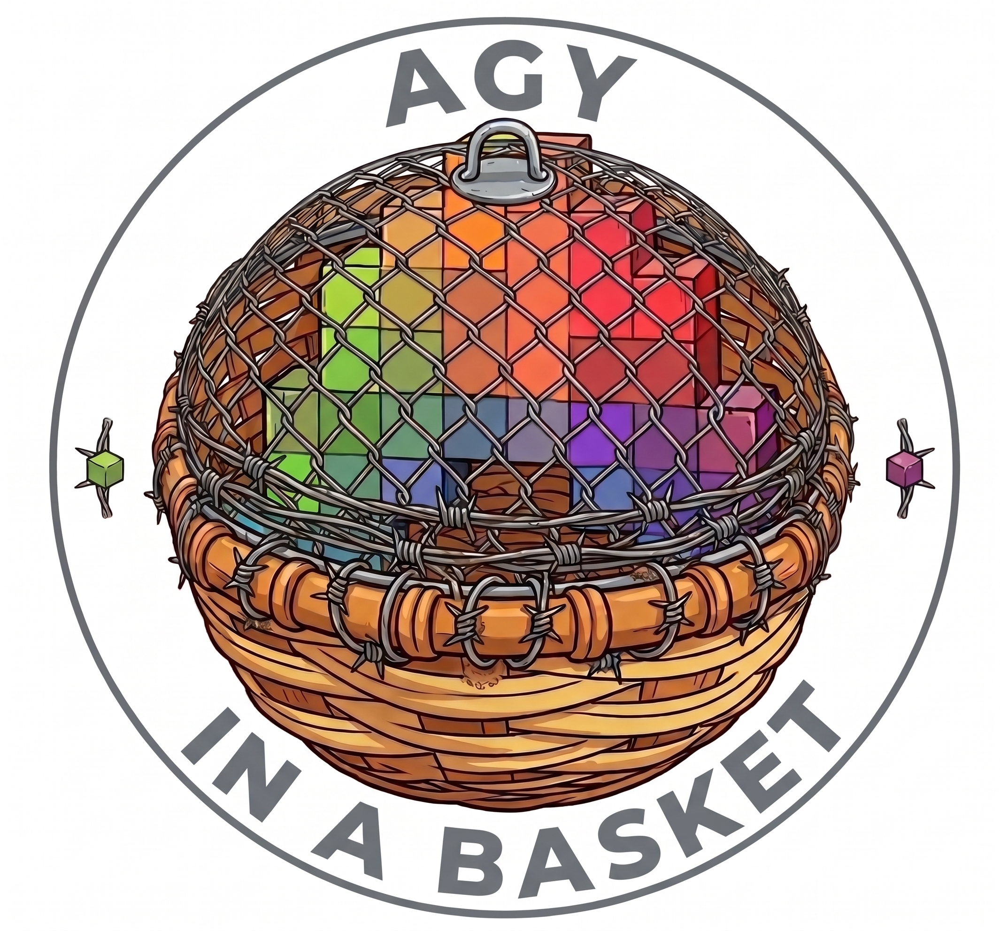
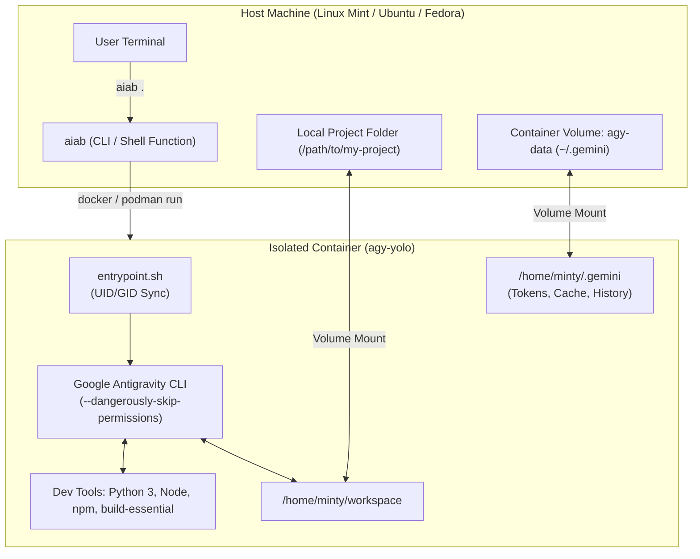
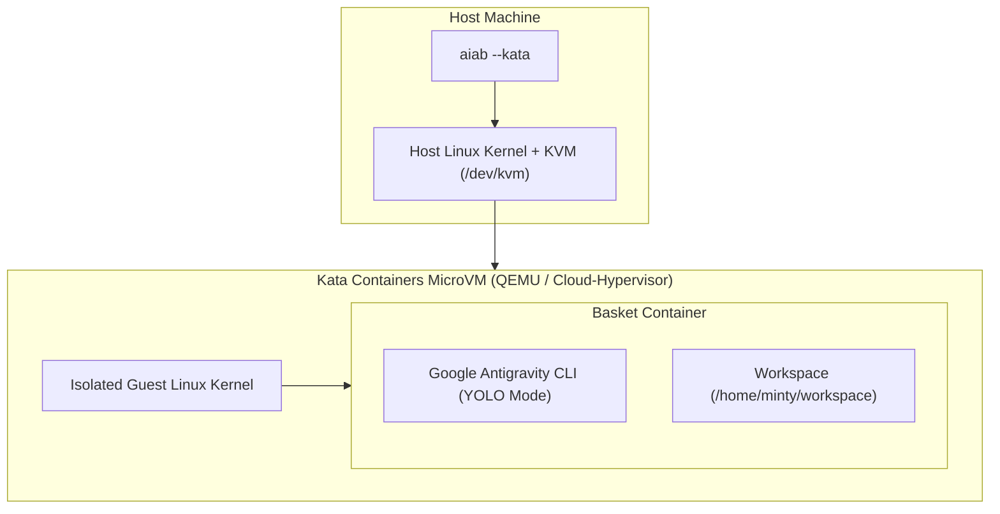

# agyInABasket 🧺

<p align="center">
  
</p>

> **Safe, autonomous, sandboxed Google Antigravity CLI (`agy`) inside an ephemeral container (Docker or Podman) with persistent authentication and zero host file permission issues.**

---

## 🎯 The Concept

Google Antigravity CLI (`agy`) equipped with `--dangerously-skip-permissions` (**YOLO Mode**) gives AI coding agents total autonomy: creating files, executing build scripts, debugging tests, and installing packages without prompting for manual confirmation on every action.

Running YOLO mode directly on a personal host workstation carries risk:
- Errant commands or scripts can affect personal files outside the workspace.
- Ad-hoc packages clutter the host operating system.
- Background daemons and network services have host-level access.

**agyInABasket** encapsulates `agy` inside an isolated container (supporting both **Docker** and rootless **Podman**):
- **Sandbox Security:** The container only sees the specific project folder mounted into `/home/minty/workspace`. Host root and parent directories remain completely inaccessible.
- **True Host UID/GID Alignment:** The container dynamically builds matching your host user's exact UID and GID (e.g. `1000:1000`). Files created by the agent are owned by *you* on the host—no `root` ownership bugs or `git safe.directory` permission errors.
- **Rootless Podman Ready:** Auto-detects Podman and injects `--userns=keep-id` and SELinux volume relabeling (`:Z`) out of the box.
- **Optional Hardware Hypervisor Isolation (Kata Containers):** Run the container inside a dedicated hardware KVM microVM using `--kata`. Even a root-level kernel exploit cannot escape into the host operating system.
- **Persistent Auth & Sessions:** Google OAuth tokens, conversation logs, and settings are saved into a dedicated container volume (`agy-data`), so you log in once and stay authenticated across all projects and sessions.
- **Pre-baked Developer Toolchains:** Pre-loaded with Python 3, pip, venv, Node.js, npm, build-essential, git, ripgrep, and jq, plus passwordless `sudo` inside the container for ephemeral dependencies.

---

## 🏗️ Architecture



---

## 🚀 Quick Start

### 1. Prerequisites
- Linux host (tested on Linux Mint, Ubuntu, Debian, Fedora, and Arch).
- Either **Docker** or **Podman** installed:
  - **Docker:** Ensure your user is in the `docker` group (`sudo usermod -aG docker $USER && newgrp docker`).
  - **Podman:** Works rootless out-of-the-box (no daemon or root group required).

### 2. Installation
Clone the repository and run the automated installer:

```bash
git clone https://github.com/Dakron42/agyInABasket.git
cd agyInABasket
./scripts/install.sh
```

The installer will:
1. Detect your host `UID` and `GID` (`$(id -u):$(id -g)`).
2. Build the `agy-yolo:latest` and `agy-basket:latest` Docker images.
3. Initialize the persistent `agy-data` volume.
4. Symlink `aiab` to `~/.local/bin/`.
5. Offer to source the shell function in your `~/.bashrc` / `~/.bash_aliases`.

---

## 💻 Usage

### Launching in the Current Directory
From inside any git repository or project folder on your host:

```bash
aiab
```

### Launching for a Specific Project
Specify the path to any local project:

```bash
aiab ~/code/my-web-app
```

### Resuming Conversations & Passing Options
Any additional flags are forwarded directly to `agy`:

```bash
# Resume the previous conversation
aiab . --continue

# Specify an agent model
aiab . --model "Gemini 2.5 Pro"

# Set reasoning effort
aiab . --effort high
```

### Dropping into an Interactive Shell (Debugging)
To inspect the container environment or test custom binaries:

```bash
aiab . bash
```

### Hardware Hypervisor Isolation (Kata Containers)
By default, **`aiab` automatically defaults to Kata Containers microVM isolation whenever Kata and `/dev/kvm` are detected on your host!** *(Note: Kata microVM isolation runs on Docker via containerd shimv2; Podman runs with standard container isolation).* If Kata is not installed, `aiab` falls back seamlessly to standard container mode.

You can also explicitly control this behavior via flags or config:

```bash
# Force hardware microVM isolation
aiab --kata

# Force standard container execution (bypasses Kata microVM for this run)
aiab --no-kata

# Specify project directory and Kata microVM
aiab ~/code/my-web-app --kata
```

---

## 🛡️ Hypervisor Isolation with Kata Containers

While standard containers provide process and namespace isolation, they share the host operating system's Linux kernel. For highest-assurance untrusted code execution, `aiab` supports **Kata Containers**.



### Why Use Kata Containers?
1. **True VM Boundary:** The basket runs inside its own lightweight hardware microVM backed by Linux KVM.
2. **Exploit Containment:** Even if an autonomous agent runs malicious code that attempts a Linux kernel exploit or `setuid` privilege escalation, the exploit only compromises the temporary microVM guest kernel—leaving your host system and personal files completely untouched.
3. **Virtio-FS Performance:** Project workspace files are shared into the microVM using `virtio-fs` for near-native read/write speeds.

> [!IMPORTANT]
> **Container Engine Compatibility: Docker Required for Kata MicroVMs**
> - **Docker** is fully compatible with Kata Containers via its containerd `shimv2` protocol (`io.containerd.kata.v2`).
> - **Podman is incompatible with Kata Containers.** The Podman CLI expects legacy direct OCI command verbs (`create`/`delete`), which modern Kata Containers does not support. Attempting to run Kata under Podman fails with:
>   ```text
>   Error: OCI runtime error: /usr/local/bin/kata-runtime: Invalid command "create"
>   ```
> - If you use **Podman**, run `aiab` with standard container isolation:
>   ```bash
>   aiab --no-kata
>   # Or set standard isolation as default:
>   aiab config set AIAB_KATA 0
>   ```
> - If both engines are installed, `aiab` automatically routes Kata microVM executions to Docker whenever Docker is running, or you can set Docker as preferred: `aiab config set CONTAINER_RUNTIME docker`.

### Host Setup & Verification
Run the built-in diagnostic tool to verify host hardware virtualization, kernel acceleration modules, and Kata runtime status:

```bash
aiab check-kata
```

#### Installing Kata Containers (Linux Mint, Ubuntu, Debian):
Kata Containers upstream distributes pre-compiled static releases (`kata-static-*.tar.zst`) that bundle QEMU, Cloud-Hypervisor, guest kernels, rootfs, and containerd shims.

`aiab` provides a one-step installer script that automates KVM checks, kernel module loading, prior version cleanup, static release extraction to `/opt/kata`, and symlink creation in `/usr/local/bin`:

```bash
# Run the automated Kata installer (defaults to 3.32.0+):
sudo ./scripts/install-kata.sh

# Ensure kvm group membership takes effect in your current shell:
newgrp kvm
```

> [!NOTE]
> `install-kata.sh` defaults to **Kata Containers 3.32.0**. This release includes the upstream fix for Docker 29+ private time namespaces (PR #13082 / Issue #13080). It also cleans up any previous Kata installations in `/opt/kata` to avoid version conflicts.

#### Manual Installation (Alternative):
If you prefer installing manually:
1. Download `kata-static-3.32.0-amd64.tar.zst` from [Kata Containers GitHub Releases](https://github.com/kata-containers/kata-containers/releases).
2. Clean any prior version and extract to `/`:
   ```bash
   sudo rm -rf /opt/kata
   sudo tar --zstd -xf kata-static-3.32.0-amd64.tar.zst -C /
   ```
3. Symlink binaries:
   ```bash
   sudo ln -sf /opt/kata/bin/kata-runtime /usr/local/bin/kata-runtime
   sudo ln -sf /opt/kata/bin/kata-ctl /usr/local/bin/kata-ctl
   sudo ln -sf /opt/kata/bin/containerd-shim-kata-v2 /usr/local/bin/containerd-shim-kata-v2
   ```
4. **Zero-Config Docker Integration:**
   With `containerd-shim-kata-v2` symlinked in `/usr/local/bin`, Docker/containerd automatically discovers the runtime as `io.containerd.kata.v2` directly from your `$PATH`. **No changes to `/etc/docker/daemon.json` are required.** (Modifying `daemon.json` with incompatible runtime keys can crash modern Docker daemons).
5. Load and persist the kernel acceleration modules (`vhost`, `vhost_net`, `vhost_vsock`):
   ```bash
   sudo modprobe vhost vhost_net vhost_vsock
   echo -e "vhost\nvhost_net\nvhost_vsock" | sudo tee /etc/modules-load.d/kata.conf
   ```
6. Add your user to the `kvm` group:
   ```bash
   sudo usermod -aG kvm $USER
   newgrp kvm
   ```

### 🩺 Troubleshooting Kata Containers

| Error / Symptom | Root Cause | Solution |
| :--- | :--- | :--- |
| `Invalid command "create"` | **Podman incompatibility.** Modern Kata (3.x/4.x) implements containerd's `shimv2` protocol and no longer supports legacy direct OCI command verbs (`create`/`delete`). | Run via Docker: `CONTAINER_RUNTIME=docker aiab`<br>Or disable Kata when using Podman: `aiab --no-kata` |
| `Internal: failed to create shim task: invalid namespace type` | **Docker 29+ time-namespace incompatibility with older Kata.** Docker 29.5+ injects a private Linux `time` namespace into container OCI specs by default. Kata versions prior to 3.32.0 reject this namespace. | Upgrade to Kata Containers **3.32.0+** by re-running: `sudo ./scripts/install-kata.sh` |
| `Cannot connect to the Docker daemon at unix:///var/run/docker.sock` | **Docker daemon crash due to `/etc/docker/daemon.json`.** Modern Docker (v25+) rejects conflicting `path` and `runtimeType` definitions in `daemon.json`. | Remove or clean `/etc/docker/daemon.json`: `sudo rm -f /etc/docker/daemon.json && sudo systemctl restart docker`. Docker uses `$PATH` discovery for `io.containerd.kata.v2` automatically without `daemon.json`. |
| `kernel property vhost_vsock not found` | Host kernel virtio acceleration modules are not loaded into the running Linux kernel. | Load and persist the modules:<br>`sudo modprobe vhost vhost_net vhost_vsock`<br>`echo -e "vhost\nvhost_net\nvhost_vsock" \| sudo tee /etc/modules-load.d/kata.conf` |
| `Permission denied accessing /dev/kvm` | The current user is not a member of the `kvm` group, or group membership has not refreshed in the active shell. | Add user to group and refresh:<br>`sudo usermod -aG kvm $USER && newgrp kvm` |

---

## 🐚 Shell Function (`~/.bashrc`)

If you prefer using a native bash function on your host machine, you can source [`shell/aiab.bash`](file:///home/minty/workspace/shell/aiab.bash) or add this to your `~/.bashrc`:

```bash
source /path/to/agyInABasket/shell/aiab.bash
```

Or paste the function directly:

```bash
aiab() {
    local target_dir="${1:-.}"
    if [ -d "$target_dir" ]; then shift; else target_dir="."; fi
    local resolved_dir; resolved_dir=$(realpath "$target_dir") || return 1

    docker run -it --rm \
        --name "agy-$(basename "$resolved_dir" | tr -c 'a-zA-Z0-9_' '_')-$$" \
        -e TERM="${TERM:-xterm-256color}" \
        -v "agy-data:/home/minty/.gemini" \
        -v "agy-config:/home/minty/.config" \
        -v "$resolved_dir:/home/minty/workspace" \
        agy-yolo "$@"
}
```

---

## 🛠️ Maintenance & Lifecycle

Maintenance and lifecycle operations are built directly into `aiab`:

| Command | Description |
| :--- | :--- |
| `aiab config` | Opens interactive settings menu to set default isolation (Kata on/off), engine, and model. |
| `aiab update` | Pulls latest Ubuntu base and rebuilds the container with the newest `agy` CLI release. |
| `aiab rebuild` | Forces a complete rebuild from scratch without Docker cache. |
| `aiab status` | Inspects container images, volume sizes, CLI version, and Kata hypervisor readiness. |
| `aiab check-kata` | Runs diagnostic checks on hardware KVM virtualization, Kata binaries, and runtime daemons. |
| `aiab clean` | Removes dangling Docker images and stopped `agy` containers. |
| `aiab backup-auth` | Backs up persistent OAuth tokens and databases to `~/agy-auth-backup-*.tar.gz`. |
| `aiab reset-auth` | Clears persistent login tokens and prompts for re-authentication. |
| `aiab uninstall` | Removes the Docker images and symlinks from `~/.local/bin`. |

---

## ⚙️ Persistent Configuration Menu

Instead of passing flags or setting environment variables on every terminal session, you can configure your personal defaults using the interactive settings menu:

```bash
aiab config
```

```text
==========================================================
           agyInABasket (aiab) Settings Menu              
==========================================================
Config file: ~/.config/aiab/config

  1) Hypervisor Isolation (Kata):  [Disabled]
  2) Default Container Engine:     [auto]
  3) Kata Runtime Identifier:      [kata-runtime]
  4) Default Model:                [<none>]
  5) Default Effort:               [<none>]
  6) Run Diagnostics (check-kata)
  r) Reset all to defaults
  q) Quit / Exit
==========================================================
Select an option (1-6, r, q): 
```

### Scriptable Configuration (CLI)
You can also view and edit settings programmatically:

```bash
# View all current settings
aiab config show

# Set Kata microVM to auto-detect (Default: uses Kata if installed)
aiab config set AIAB_KATA auto

# Always require Kata microVM (fails if KVM/Kata missing)
aiab config set AIAB_KATA 1

# Always use standard container (bypasses Kata)
aiab config set AIAB_KATA 0

# Set default container engine to podman or docker
aiab config set CONTAINER_RUNTIME podman

# Set a default agent model
aiab config set DEFAULT_MODEL "Gemini 2.5 Pro"

# Reset configuration to defaults
aiab config reset
```

### Precedence Order
Configuration settings are resolved with the following priority (highest to lowest):
1. **CLI Flags** (e.g. `--kata`, `--no-kata`, `--model "..."`)
2. **Environment Variables** (e.g. `AIAB_KATA=1`, `CONTAINER_RUNTIME=docker`)
3. **Configuration File** (`~/.config/aiab/config`)
4. **Hardcoded Defaults** (Standard container, auto engine detection)

---

## 🧪 Testing & Contributing

A standalone test suite is included in [`tests/test_runner.sh`](file:///home/minty/workspace/tests/test_runner.sh) to verify shell scripts, flags, Docker routing, volume bindings, and argument parsing:

```bash
./tests/test_runner.sh
```

> [!IMPORTANT]
> **Pull Request Policy:** All pull requests **must** include accompanying tests in `tests/test_runner.sh`. Pull requests without tests will not be accepted. See [CONTRIBUTING.md](CONTRIBUTING.md) for full details.

---

## 📁 Repository Structure

```
agyInABasket/
├── .github/
│   ├── workflows/test.yml  # Automated CI testing on PRs and pushes
│   └── pull_request_template.md # PR template enforcing test requirement
├── Dockerfile              # Docker image definition with dev tools & UID alignment
├── entrypoint.sh           # Container entrypoint handling permissions & CLI flags
├── bin/
│   └── aiab                # Host launcher and management CLI executable
├── shell/
│   └── aiab.bash           # Shell wrapper for ~/.bashrc or ~/.bash_aliases
├── scripts/
│   ├── install.sh          # One-click host builder and initial installer
│   └── install-kata.sh     # Automated Kata Containers 3.32.0+ installer
├── tests/
│   └── test_runner.sh      # Automated test suite
├── .dockerignore           # Excludes local files from Docker build context
├── .gitignore              # Standard git ignores for logs and cache
├── CONTRIBUTING.md          # Contributing guide & PR test policies
├── LICENSE                 # MIT License
└── README.md               # Documentation and architecture guide
```

---

## 🔒 Security Notes
- **Sandboxed Scope:** The container only has access to the directory explicitly mounted to `/home/minty/workspace`.
- **Ephemeral State:** Any package installed via `sudo apt` during a session will vanish when the container exits, preventing dependency pollution on your host.
- **Tokens Isolated in Volume:** Auth tokens live exclusively in the `agy-data` Docker volume and are not stored in plaintext inside the project workspaces.

---

## 📄 License

This project is licensed under the [MIT License](LICENSE).
