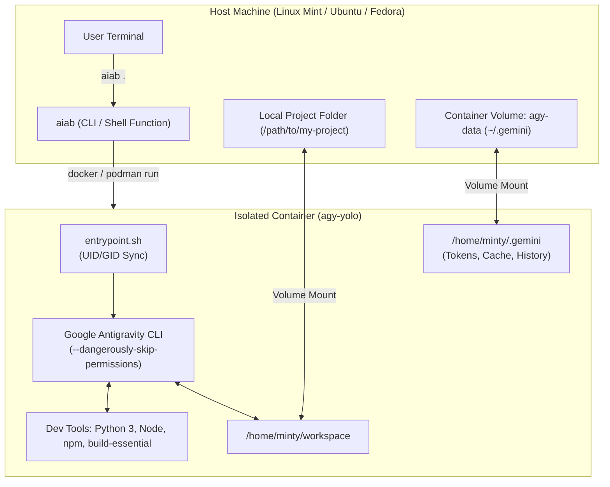

# agyInABasket 🧺

<p align="center">
  
</p>

> **Safe, autonomous, sandboxed Google Antigravity CLI (`agy`) inside an ephemeral container (Docker or Podman) with persistent authentication and zero host file permission issues.**

---

## 🎯 The Concept

Google Antigravity CLI (`agy`) equipped with `--dangerously-skip-permissions` (**YOLO Mode**) gives AI coding agents total autonomy: creating files, executing build scripts, debugging tests, and installing packages without prompting for manual confirmation on every action.

Running YOLO mode directly on a personal host workstation carries risk:
- Errant commands or scripts can affect personal files outside the workspace.
- Ad-hoc packages clutter the host operating system.
- Background daemons and network services have host-level access.

**agyInABasket** encapsulates `agy` inside an isolated container (supporting both **Docker** and rootless **Podman**):
- **Sandbox Security:** The container only sees the specific project folder mounted into `/home/minty/workspace`. Host root and parent directories remain completely inaccessible.
- **True Host UID/GID Alignment:** The container dynamically builds matching your host user's exact UID and GID (e.g. `1000:1000`). Files created by the agent are owned by *you* on the host—no `root` ownership bugs or `git safe.directory` permission errors.
- **Rootless Podman Ready:** Auto-detects Podman and injects `--userns=keep-id` and SELinux volume relabeling (`:Z`) out of the box.
- **Persistent Auth & Sessions:** Google OAuth tokens, conversation logs, and settings are saved into a dedicated container volume (`agy-data`), so you log in once and stay authenticated across all projects and sessions.
- **Pre-baked Developer Toolchains:** Pre-loaded with Python 3, pip, venv, Node.js, npm, build-essential, git, ripgrep, and jq, plus passwordless `sudo` inside the container for ephemeral dependencies.

---

## 🏗️ Architecture



---

## 🚀 Quick Start

### 1. Prerequisites
- Linux host (tested on Linux Mint, Ubuntu, Debian, Fedora, and Arch).
- Either **Docker** or **Podman** installed:
  - **Docker:** Ensure your user is in the `docker` group (`sudo usermod -aG docker $USER && newgrp docker`).
  - **Podman:** Works rootless out-of-the-box (no daemon or root group required).

### 2. Installation
Clone the repository and run the automated installer:

```bash
git clone https://github.com/Dakron42/agyInABasket.git
cd agyInABasket
./scripts/install.sh
```

The installer will:
1. Detect your host `UID` and `GID` (`$(id -u):$(id -g)`).
2. Build the `agy-yolo:latest` and `agy-basket:latest` Docker images.
3. Initialize the persistent `agy-data` volume.
4. Symlink `aiab` to `~/.local/bin/`.
5. Offer to source the shell function in your `~/.bashrc` / `~/.bash_aliases`.

---

## 💻 Usage

### Launching in the Current Directory
From inside any git repository or project folder on your host:

```bash
aiab
```

### Launching for a Specific Project
Specify the path to any local project:

```bash
aiab ~/code/my-web-app
```

### Resuming Conversations & Passing Options
Any additional flags are forwarded directly to `agy`:

```bash
# Resume the previous conversation
aiab . --continue

# Specify an agent model
aiab . --model "Gemini 2.5 Pro"

# Set reasoning effort
aiab . --effort high
```

### Dropping into an Interactive Shell (Debugging)
To inspect the container environment or test custom binaries:

```bash
aiab . bash
```

---

## 🐚 Shell Function (`~/.bashrc`)

If you prefer using a native bash function on your host machine, you can source [`shell/aiab.bash`](file:///home/minty/workspace/shell/aiab.bash) or add this to your `~/.bashrc`:

```bash
source /path/to/agyInABasket/shell/aiab.bash
```

Or paste the function directly:

```bash
aiab() {
    local target_dir="${1:-.}"
    if [ -d "$target_dir" ]; then shift; else target_dir="."; fi
    local resolved_dir; resolved_dir=$(realpath "$target_dir") || return 1

    docker run -it --rm \
        --name "agy-$(basename "$resolved_dir" | tr -c 'a-zA-Z0-9_' '_')-$$" \
        -e TERM="${TERM:-xterm-256color}" \
        -v "agy-data:/home/minty/.gemini" \
        -v "agy-config:/home/minty/.config" \
        -v "$resolved_dir:/home/minty/workspace" \
        agy-yolo "$@"
}
```

---

## 🛠️ Maintenance & Lifecycle

Maintenance and lifecycle operations are built directly into `aiab`:

| Command | Description |
| :--- | :--- |
| `aiab update` | Pulls latest Ubuntu base and rebuilds the container with the newest `agy` CLI release. |
| `aiab rebuild` | Forces a complete rebuild from scratch without Docker cache. |
| `aiab status` | Inspects container images, volume sizes, and CLI version. |
| `aiab clean` | Removes dangling Docker images and stopped `agy` containers. |
| `aiab backup-auth` | Backs up persistent OAuth tokens and databases to `~/agy-auth-backup-*.tar.gz`. |
| `aiab reset-auth` | Clears persistent login tokens and prompts for re-authentication. |
| `aiab uninstall` | Removes the Docker images and symlinks from `~/.local/bin`. |

---

## 🧪 Testing & Contributing

A standalone test suite is included in [`tests/test_runner.sh`](file:///home/minty/workspace/tests/test_runner.sh) to verify shell scripts, flags, Docker routing, volume bindings, and argument parsing:

```bash
./tests/test_runner.sh
```

> [!IMPORTANT]
> **Pull Request Policy:** All pull requests **must** include accompanying tests in `tests/test_runner.sh`. Pull requests without tests will not be accepted. See [CONTRIBUTING.md](CONTRIBUTING.md) for full details.

---

## 📁 Repository Structure

```
agyInABasket/
├── .github/
│   ├── workflows/test.yml  # Automated CI testing on PRs and pushes
│   └── pull_request_template.md # PR template enforcing test requirement
├── Dockerfile              # Docker image definition with dev tools & UID alignment
├── entrypoint.sh           # Container entrypoint handling permissions & CLI flags
├── bin/
│   └── aiab                # Host launcher and management CLI executable
├── shell/
│   └── aiab.bash           # Shell wrapper for ~/.bashrc or ~/.bash_aliases
├── scripts/
│   └── install.sh          # One-click host builder and initial installer
├── tests/
│   └── test_runner.sh      # Automated test suite
├── .dockerignore           # Excludes local files from Docker build context
├── .gitignore              # Standard git ignores for logs and cache
├── CONTRIBUTING.md          # Contributing guide & PR test policies
├── LICENSE                 # MIT License
└── README.md               # Documentation and architecture guide
```

---

## 🔒 Security Notes
- **Sandboxed Scope:** The container only has access to the directory explicitly mounted to `/home/minty/workspace`.
- **Ephemeral State:** Any package installed via `sudo apt` during a session will vanish when the container exits, preventing dependency pollution on your host.
- **Tokens Isolated in Volume:** Auth tokens live exclusively in the `agy-data` Docker volume and are not stored in plaintext inside the project workspaces.

---

## 📄 License

This project is licensed under the [MIT License](LICENSE).
